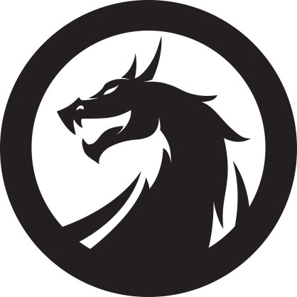

<p align="center" >
 
</p>
<p align="center">
  <strong>
  dragon aims to be a full environment for development and research on Apple devices.
  </strong>
</p>

_An alternative to theos, a convenient development environment, and more..._

# Installing dragon

In your terminal:

`bash <(curl -sL dr.krit.me)`

---

This readme needs work and doesn't come close to covering the scope of the project.

`dragon -h` includes a list of available supported stable features on the current build.

Reaching out to me on #development on the r/jb discord server is reccomended if you're having issues with anything.

---

# The Build System

dragon supports theos projects alongside it's own, powerful, expandable format.

## Using Makefiles

A good majority of projects built with Theos will build out of the box with dragon.

**If your Theos project fails to build, file an issue with a link to it.** This is insanely helpful when it comes to improving the interpreter. 

## Using DragonMake

DragonMake is a YAML-based format that represents an entire project and all subprojects within a single file.

It was created with the goal of being writable by hand, without the help of a "New Instance Creator". Dragon's NIC is being worked on; It is however, lightly on hold, so as not to encourage new users to leap into this project just yet.

### "Modules" and the "Project"

Regardless of folder layout, there are no "subprojects" in dragon. Instead, you have a single "Project", which then has "Modules" (your tweak, your prefs, etc).

This format makes working with complex projects much easier, and keeps things incredibly organized without limiting your freedom.

See the example below to get an idea

### DragonMake Sample

This should serve as a guideline for how a project should be laid out. You can declare as many modules as you want within your project.

"ModuleName" represents a module, here. Typically this is "TweakName" or "TweakNamePrefs", or something along those lines.

```yaml
---
# This represents the overall project name. 
name: TweakName
icmd: sbreload

# Variables declared here apply to all modules.
all:
  targetvers: 11.0
  archs:
    - arm64
    - arm64e

# This represents a Tweak .dylib and .plist. 
ModuleName:
    type: tweak
    # A list of logos files. See variables section for more info. 
    logos_files:
        - "*.xm"
        
# Now for preferences!
AnotherModuleName:
    # Specify the directory, since it's a subproject
    dir: nameprefs
    # Tell dragon that it's a bundle
    type: prefs
    # You can specify files from anywhere in your tweak, or use directory specific wildcards
    objc_files:
        - BlahRootListController.m
        - ACellYouUse.m
        - ../SomeFileFromYourMainTweak.m
        
# If you have a tweak subproject that, for example, hooks another process, you can compile it into the same deb
# This is the minimal amount of info you can provide and have your project compile. 
ASubModuleName:
    dir: othertweak
    type: tweak
    files:
        - othertweak/Tweak.xm    
```


### DragonMake Syntax

Variables within the dragonmake can be referenced via `$varname`

Environment Variables can be referenced with `$$varname`

You can evaluate a command in a subshell via `$$(command args)`

Wildcards:  
  `"*.<x>"` is the syntax. `**` and other globbing rules are applied. 
  Type `ls <your wildcard here>` to get an idea. 


## DragonMake Variables

Top Level Variables

| Name | Type | Description | Default |
| ---- | ---- | ----------- | ------- |
| `name` | str | Name of the whole project | N/A |
| `icmd` | str | Command to run on device after install | `killall -9 SpringBoard` |
| `all` | dict | Variables here will be applied to all modules and can be overridden individually |  |

Module Variables

| Name | Type | Description | Default |
| ---- | ---- | ----------- | ------- |
| `type` | str | Type of project being built. See [Project_Types](#Project_Types) | N/A |
| `files` | list | List of files to be compiled. These will be sorted into proper groups by extension. | [] |
| `logos_files` | list | List of files that require the logos preprocessor | [] |
| `c_files` | list | List of files to build as .c source | [] |
| `cxx_files` | list | List of files to build as .cpp source | [] |
| `objc_files` | list | List of files to build as .m source | [] |
| `objcxx_files` | list | List of files to build as .mm source | [] |
| `target` | str | OS being targeted. By default, iOS. You can define your own, too; See [Targets](#Targets) | [] | 
| `targetvers` | str | iOS Version being targeted. | [] | 
| `archs` | list | Architectures to compile for | [] |
| `sysroot` | str | Root of the Patched SDK to build with | $DRAGONBUILD/sdks/iPhoneOS.sdk |
| `cc` | str | c/c++ compiler to use | clang |
| `cxx` | str | c/c++ compiler to use | clang++ |
| `ld` | str | linker to use | clang/clang++ |
| `lipo` | str | lipo tool to use | lipo |
| `codesign` | str | ldid binary to sign with | ldid |
| `dsym` | str | dsymutil binary to symbolicate with | dsymutil |
| `plutil` | str | dsymutil binary to symbolicate with | plutil |
| `swift` | str | dsymutil binary to symbolicate with | swift |
| `logos` | str | logos.pl file to use for preprocessing | `$DRAGONBUILD/bin/logos.pl` | 
| `stage` | str/list | Console command(s) to run before after build and before packaging | '' |
| `arc` | BOOL | Should we use -fobjc-arc | `Yes` |
| `warnings` | str | Warnings flag | -Wall |
| `optim` | str | Optimization level. Higher levels can break obfuscators. | 0 |
| `debug` | str | debug flags | -fcolor-diagnostics |
| `libs` | list | List of libraries to link the binary against | '' |
| `frameworks` | list | List of Frameworks to compile with | ['CoreFoundation', 'Foundation', 'UIKit', 'CoreGraphics', 'QuartzCore', 'CoreImage', 'AudioToolbox'] |
| `cflags` | str | additional flags to pass to clang and the linker. Will be applied after everything else. | '' |
| `ldflags` | str | additional flags to pass to the linker. Applied after cflags. | '' |
| `entflag` | str | custom flag for codesign util | '-S' |
| `entfile` | str | Applied directly after entflag. Typically for ldid, an entitlement plist. | '' |
| `install_location` | str | override variable for bundles/libraries to allow specifying install location | '' |
| `fw_dirs` | list | Framework Search Dirs. Changing this variable overrides defaults. | ['$sysroot/System/Library/Frameworks', '$sysroot/System/Library/PrivateFrameworks', '$dragondir/frameworks'] |
| `additional_fw_dirs` | list | Allows adding framework search dirs without overwriting old ones. | [] |
| `lib_dirs` | list | Library search dirs. Just like the framework search | ['$dragondir/lib', '.'] |
| `additional_lib_dirs` | list | Add to lib search without overwriting | [] | 

You can reference any of these variables in a variable *below* it (really, avoid doing this please) using `$var`

## dragon commands

Most of these can be combined, if needed.

`dragon update` will update your dragonbuild installation to the latest version.

`dragon -h` outputs the following:

```yaml

dragon -=-=-
  usage: dragon [commands]

Building -=-=-
  do - Build and Install
  c|clean - recompile, link, and package your project
  b|build|make - compile, link, and package your project
  r|release - Load DragonRelease file over the DragonMake one
  rl|relink - Re-link the package regardless of changes

Installation -=-=-
  s|device - Set build device IP/Port
  i|install - Install to build device
  sim - Add this to install to the simulator instead of a device

Tools -=-=-
  d|debug [Process Name] - Start a debugging server on device and connect to it (Can be used with the install flag as well)
  rs|respring - Respring the current build device
  dr|devicerun - Run anything after this flag on device
  sn|send <file> - Install a .deb to the device
  
  exp|export - Tell ninja to create a compile_commands.json
  f|flutter - Build with flutter before doing anything else
  ch|checkra1n - Open Checkra1n GUI
  chc|checkra1ncli - Open Checkra1n CLI

Debugging -=-=-
  vn - Print clang/ld/etc. commands and flags
  vd - echo every bash command in the main dragon file
  vg - DragonGen verbositiy.
  norm - Doesn't delete build.ninja after building.
  ddebug - Enable all debug flags

-=-=-
```


### Configure connected device

`dragon s` (`setup`). This is ran automatically if one isn't yet configured.

When installing to a phone, if passwordless-authentication hasn't been configured, dragon will optionally configure it for you.

#### Installing over USB

Run `dragon s` but leave the "IP" field empty. It will then use iproxy to install the package over usb.

#### Respring connected device

`dragon rs`

#### Run a command on connected device

`dragon dr <command here>` - Anything after `dr` is ran on device.

`dragon dr` with no further arguments will open an ssh session.

### Building on-device

A "dragon support" package for jailbroken iOS is being developed. 

dragon will autodetect if it's running on a phone. 

If so, the `install` flag will install it to the current device and respring it.

[Full List Of Commands](#dragonbuild-commands)


## Project Types

```yml
  app: iOS Application
  application: same as `app`
  tweak: iOS Runtime Extension
  prefs: PreferenceLoader bundle
  bundle: Standard executable bundle
  framework: Obj-C Framework
  resource-bundle: Bundle with no executable compiled.
  stage: Runs the command or list of commands in the `stage:` variable and does nothing else.
  library: Simple dynamic library
  cli: Command line tool
  tool: same as `cli`
  static: Static library
```

# Helpful links

[sbinger's arm64e toolchain](https://github.com/sbingner/llvm-project/releases/tag/v10.0.0-1)
