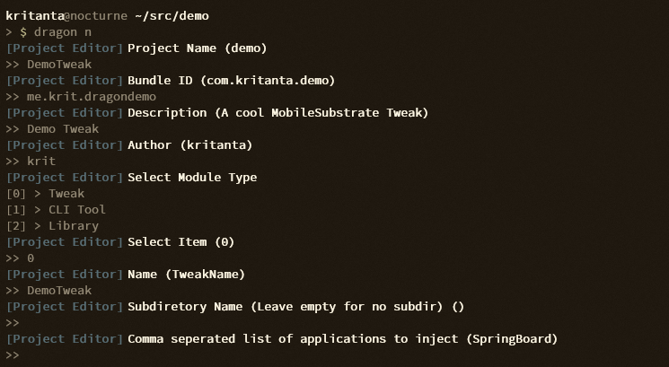

Quick-Start Guide
---------------------

Installing dragonbuild::
    
    pip3 install dragon 
    dragon

Creating your first project::

    dragon n

This opens the dragon project editor

Building your project::
    
    dragon b

Installing your project::

    dragon i 

You can do both of these at the same time; most commands in dragon can be combined::
    
    dragon b i
